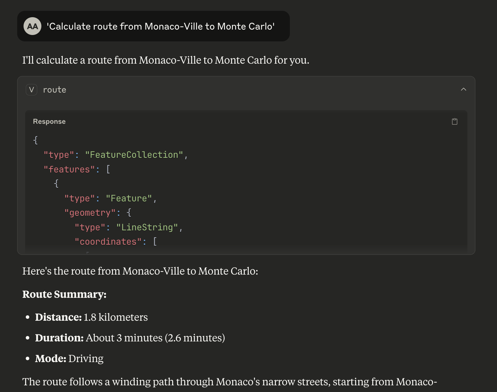

# Valhalla MCP Server

A Model Context Protocol (MCP) server that provides seamless integration between Claude Desktop and the Valhalla Open-Street-Map routing engine. Access professional routing and isochrone capabilities directly from your AI conversations without complex APIs.


## Example Usage



*Claude Desktop showing a route calculation between two points with detailed GeoJSON response from Valhalla MCP Server*

## Features

### Currently Supported Valhalla Services

| **MCP Tool/Resource** | **Valhalla Service** | **Description** |
|----------------------|---------------------|-----------------|
| `route` tool | `/route` | Single origin → destination routing with alternatives |
| `isochrone` tool | `/isochrone` | Travel time polygons showing reachable areas |
| `health` resource | `/status` | Server status and version information |
| `tile` resource | `/tile/{z}/{x}/{y}` | Vector tiles for client-side rendering |

### Valhalla Services - Coming Soon

| **Service** | **Description** | **Use Cases** |
|-------------|-----------------|---------------|
| **Matrix** | Distance/time matrices for multiple origins/destinations | Delivery optimization, logistics planning |
| **Map-matching** | Match GPS coordinates to road network | GPS trace cleaning, route correction |
| **Elevation** | Elevation profiles along routes or at points | Hiking routes, difficulty analysis |
| **Expansion** | Graph traversal visualization | Network analysis, reachability studies |
| **Locate** | Detailed metadata about nodes and edges | Address geocoding, road attributes |
| **Centroid** | Optimal convergence point from multiple locations | Meeting point optimization |
| **Optimized Route** | Multi-stop delivery routing with constraints | Logistics, delivery services |

### Transportation Modes

- `auto` - Car routing
- `bicycle` - Bicycle routing  
- `pedestrian` - Walking routes
- `taxi` - Taxi routing
- `bus` - Public transit routing

## Quick Start

### Prerequisites

- Node.js 18+ 
- Claude Desktop
- NPM or Yarn package manager

### Option 1: Demo API (Fastest Setup)

For testing and development, use the public Valhalla demo API:

```bash
# Clone and setup
git clone <repository-url>
cd valhalla-mcp
npm install
npm run build

# Configure environment variables
cp env.example .env
# Edit .env file and set VALHALLA_BASE_URL=https://valhalla1.openstreetmap.de
```

### Option 2: Local Valhalla Server (Production)

For production use or custom datasets:

```bash
# Prerequisites: Docker and Docker Compose
./start-mvp.sh
```

This script will:
- Build the MCP server
- Start local Valhalla with Monaco OSM data
- Wait for services to be ready
- Run integration tests
- Provide Claude Desktop configuration

### Claude Desktop Integration

1. Open Claude Desktop settings
2. Add to your MCP configuration:

**For Demo API (recommended for testing):**
```json
{
  "mcpServers": {
    "valhalla-mcp": {
      "command": "node",
      "args": ["dist/index.js"],
      "cwd": "/YOUR/PATH/TO/valhalla-mcp",
      "env": {
        "VALHALLA_BASE_URL": "https://valhalla1.openstreetmap.de"
      }
    }
  }
}
```

**For Local Valhalla Server:**
```json
{
  "mcpServers": {
    "valhalla-mcp": {
      "command": "node",
      "args": ["dist/index.js"],
      "cwd": "/YOUR/PATH/TO/valhalla-mcp",
      "env": {
        "VALHALLA_BASE_URL": "http://localhost:8002"
      }
    }
  }
}
```

3. Update the `cwd` path to your actual project location

4. Restart Claude Desktop

### Test Your Installation

Try these commands in Claude Desktop to verify everything works:

**Basic routing:**
- *"Calculate route from Monaco-Ville to Monte Carlo"*
- *"Get driving directions from 43.7384,7.4246 to 43.7396,7.4263"*
- *"Calculate bicycle route from 43.7350,7.4200 to 43.7450,7.4300"*

**Travel time analysis:**
- *"Show 10-minute drive isochrone from Monaco center"*
- *"Generate 15-minute bicycle travel polygon from 43.7311,7.4197"*

**You should receive detailed GeoJSON responses with route geometries and travel statistics!**

### Development Mode

For development with auto-reload:
```bash
npm run dev
```

## Configuration

### Environment Variables

The server uses environment variables for configuration. Create a `.env` file from the template:

```bash
cp env.example .env
```

Available environment variables:

- `VALHALLA_BASE_URL` - Base URL for Valhalla service (default: http://localhost:8002)
- `DEBUG` - Enable debug logging (default: false)
- `LOG_LEVEL` - Log level: error, warn, info, debug (default: info)
- `MCP_SERVER_NAME` - MCP server name (default: valhalla-mcp-server)
- `MCP_SERVER_VERSION` - MCP server version (default: 0.1.0)

**Common Valhalla endpoints:**
- `http://localhost:8002` - Local Docker instance (recommended)
- `https://valhalla1.openstreetmap.de` - Public demo API (✅ tested and working)
- `https://your-server.com:8002` - Custom deployment

> **Note:** The main demo URL `https://valhalla.openstreetmap.de` serves a web interface. Use `https://valhalla1.openstreetmap.de` for API access.

### Docker Deployment

The complete stack can be deployed using Docker Compose:

```bash
# Build and start all services
docker-compose up -d

# View logs
docker-compose logs -f valhalla-mcp

# Stop services
docker-compose down
```

## Usage Examples

### Route Calculation

Request a route between two points:

```json
{
  "tool": "route",
  "arguments": {
    "origin": { "lat": 52.5200, "lon": 13.4050 },
    "destination": { "lat": 52.5170, "lon": 13.3888 },
    "mode": "bicycle",
    "alternatives": 2,
    "units": "kilometers"
  }
}
```

Response includes GeoJSON LineString with route geometry and summary statistics:

```json
{
  "type": "FeatureCollection",
  "features": [{
    "type": "Feature",
    "geometry": {
      "type": "LineString",
      "coordinates": [[13.4050, 52.5200], [13.3888, 52.5170]]
    },
    "properties": {
      "distance_km": 2.1,
      "duration_seconds": 420,
      "duration_minutes": 7,
      "mode": "bicycle"
    }
  }]
}
```

### Isochrone Generation

Generate a 15-minute travel time polygon:

```json
{
  "tool": "isochrone",
  "arguments": {
    "origin": { "lat": 52.5200, "lon": 13.4050 },
    "minutes": 15,
    "mode": "pedestrian"
  }
}
```

### Health Check

Access server health information:

```json
{
  "resource": "health://status"
}
```

## Integration with MCP Clients

### Claude Desktop

Add to your Claude Desktop configuration:

```json
{
  "mcpServers": {
    "valhalla": {
      "command": "node",
      "args": ["/path/to/valhalla-mcp/dist/index.js"],
      "env": {
        "VALHALLA_BASE_URL": "https://valhalla1.openstreetmap.de"
      }
    }
  }
}
```

> **Note:** Environment variables in Claude Desktop config override `.env` file values.

### Other MCP Clients

The server implements the standard MCP protocol and works with any compliant client. Use `stdio` transport for local integration.

## Architecture

```
┌─────────────────┐     MCP Protocol     ┌─────────────────┐
│   MCP Client    │ ◄─────────────────► │ Valhalla MCP    │
│ (Claude, etc.)  │    (stdio/HTTP)      │     Server      │
└─────────────────┘                      └─────────┬───────┘
                                                   │ HTTP REST
                                         ┌─────────▼───────┐
                                         │   Valhalla      │
                                         │  Routing Engine │
                                         └─────────────────┘
```

## Development

### Installation

```bash
# Install dependencies
npm install

# Build the project
npm run build
```

Key dependencies:
- `@modelcontextprotocol/sdk` - Official MCP SDK
- `axios` - HTTP client for Valhalla API calls
- `zod` - Runtime type validation
- `geojson` - GeoJSON type definitions
- `dotenv` - Environment variable management

### Testing

```bash
# Run tests
npm test

# Run tests in watch mode
npm run test:watch

# Run linting
npm run lint

# Fix linting issues
npm run lint:fix
```

### Type Checking

The project uses strict TypeScript configuration:

```bash
# Type check
npx tsc --noEmit
```

## Performance

- **Route calculation**: < 200ms (local Valhalla instance)
- **Isochrone generation**: < 300ms
- **Tile serving**: < 30ms
- **Health check**: < 5ms

Performance depends on Valhalla configuration and available OSM data.

## Contributing

1. Fork the repository
2. Create a feature branch
3. Make your changes
4. Add tests
5. Submit a pull request

## License

MIT License - see [LICENSE](LICENSE) file for details.

## Support

For issues and questions:
- Open an issue on GitHub
- Check the [MCP documentation](https://modelcontextprotocol.io)
- Review Valhalla documentation 